# Car Rental Android App

Мобильное приложение для аренды автомобилей, написанное на Kotlin с использованием Jetpack Compose.

## Что умеет приложение

- **Каталог автомобилей** — просмотр доступных машин с фильтрацией по параметрам
- **Бронирование** — оформление аренды с выбором дат и условий
- **Мои брони** — история и текущие бронирования
- **Избранное** — сохранение понравившихся автомобилей
- **AI ассистент** — встроенный чат для помощи с выбором автомобиля
- **OCR сканер** — распознавание текста с документов через камеру
- **Личный профиль** — управление аккаунтом и данными пользователя
- **Онбординг** — знакомство с приложением при первом запуске

## Стек технологий

| Область | Технология |
|---|---|
| Язык | Kotlin |
| UI | Jetpack Compose + Material 3 |
| Навигация | Navigation Compose |
| База данных | Room |
| Сеть | Retrofit + OkHttp |
| AI | Groq API (LLaMA 3.1) |
| OCR | Google ML Kit |
| Изображения | Coil |
| Архитектура | MVVM + Repository pattern |

## Запуск проекта

1. Клонируйте репозиторий
   git clone https://github.com/aubakir01/car-rental-android.git

2. Создайте файл `local.properties` в корне проекта и добавьте ваш Groq API ключ:
   GROQ_API_KEY=your_api_key_here

3. Получить бесплатный ключ можно на [console.groq.com](https://console.groq.com)

4. Откройте проект в Android Studio и запустите на эмуляторе или устройстве

## Минимальные требования

- Android 7.0 (API 24) и выше
- Android Studio Hedgehog или новее

## Скриншоты

### Онбординг

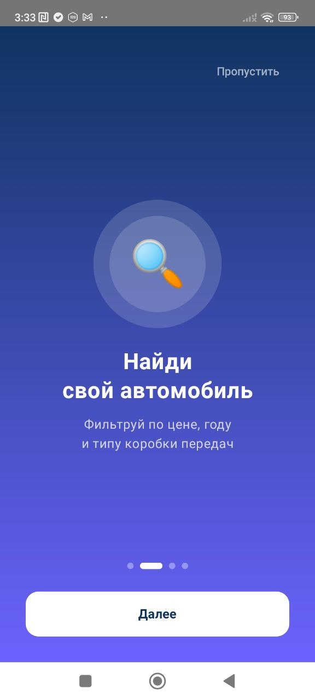

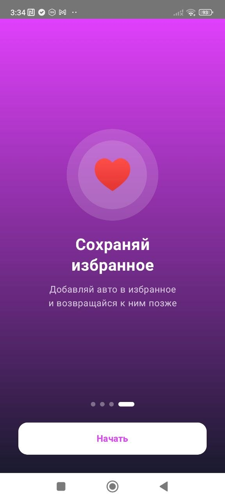

### Авторизация

### Каталог автомобилей
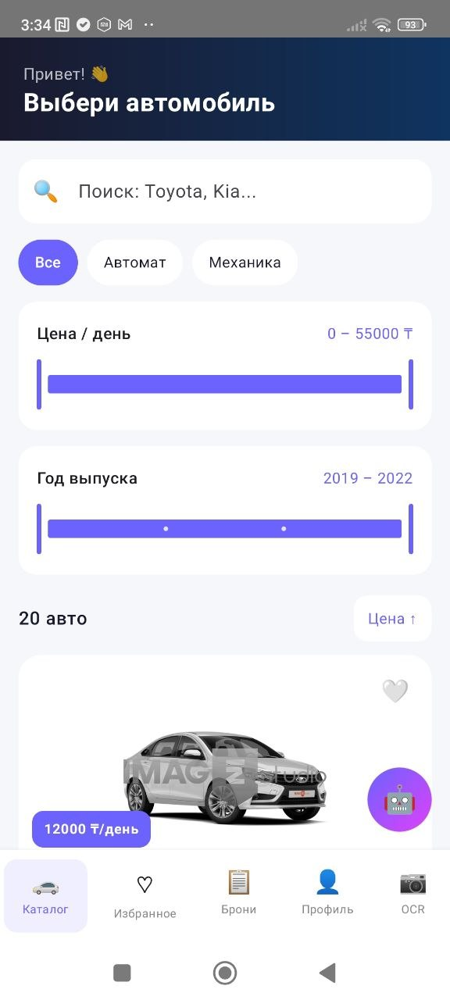
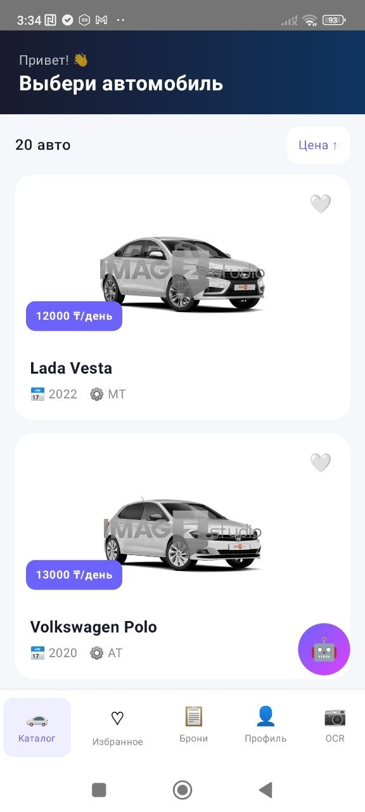

### Детали автомобиля
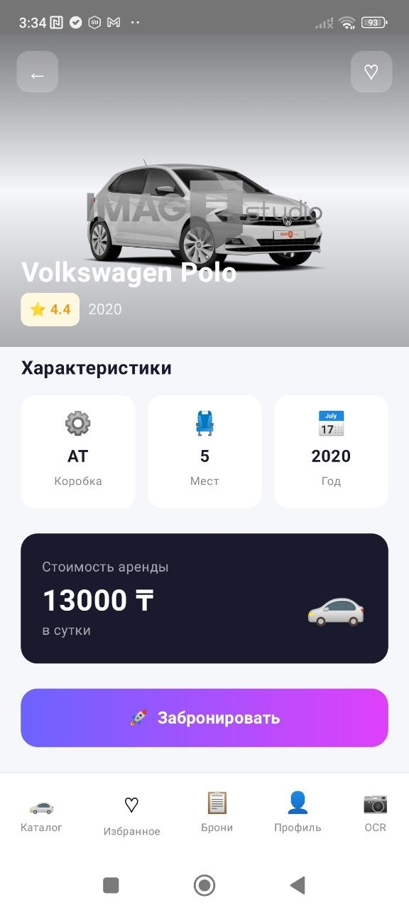

### Бронирование
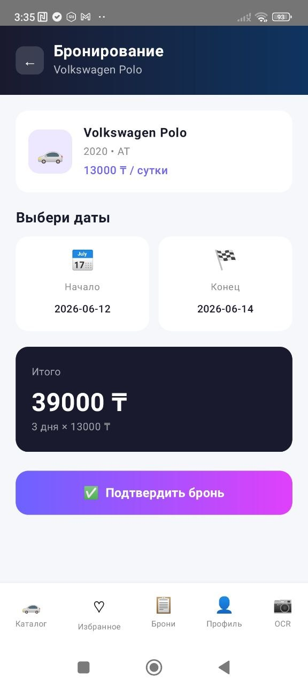

### Мои брони
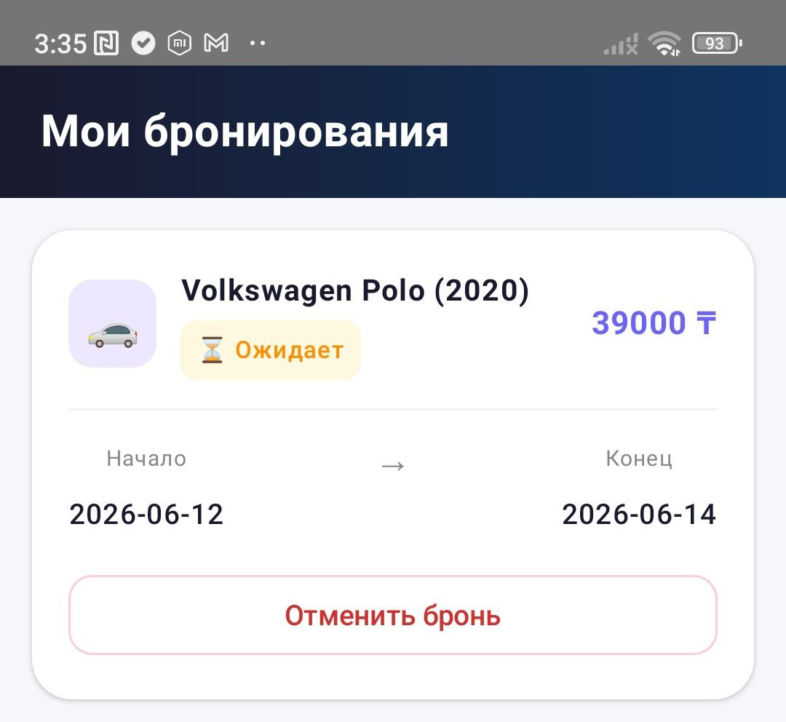

### Избранное
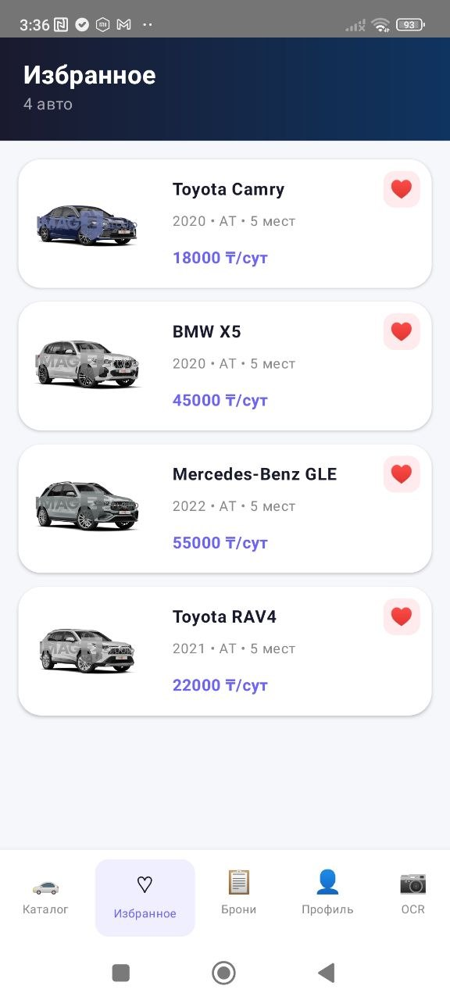

### AI ассистент
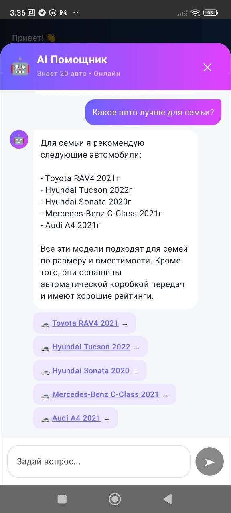

### OCR сканер
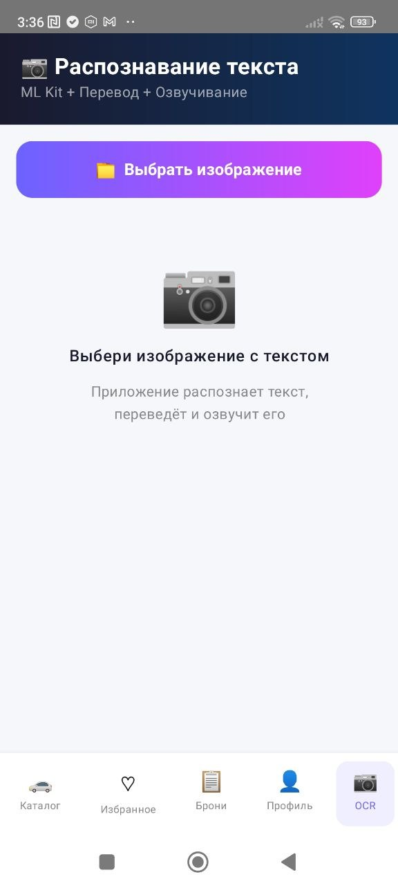

### Профиль
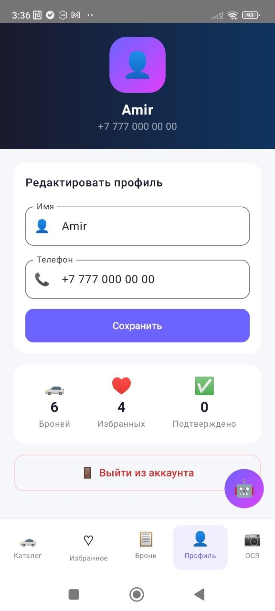